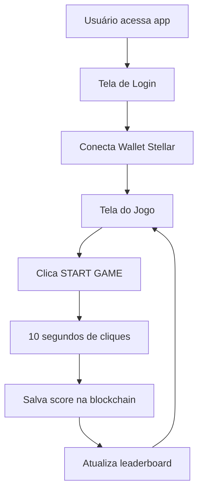

# 🎮 Stellar Tap-to-Earn Game

Um jogo **Tap-to-Earn** estilo 8-bit minimalista integrado à blockchain **Stellar**. Os jogadores têm 10 segundos para clicar o máximo possível e salvar sua pontuação na blockchain, competindo em um ranking global.

## ✨ Características Principais

- 🎯 **Jogo Tap-to-Earn**: 10 segundos de cliques intensos
- 🏆 **Ranking Global**: Leaderboard salvo na blockchain Stellar
- 🎨 **Design 8-bit**: Interface minimalista com apenas 5 cores
- 🔗 **Integração Stellar**: Conexão via Stellar wallet
- ⚡ **Performance**: Arquitetura otimizada e responsiva
- 🏗️ **Arquitetura Limpa**: Separação clara de responsabilidades

## 🎮 Como Jogar

1. **Conecte sua wallet Stellar** através do Stellar SDK
2. **Clique em "START GAME"** para iniciar o contador de 10 segundos
3. **Clique rapidamente** na área de jogo para aumentar sua pontuação
4. **Sua pontuação é automaticamente salva** na blockchain quando o tempo acaba
5. **Veja sua posição** no ranking global de jogadores

## 📁 Estrutura do Projeto

```
src/
├── blockchain/                 # Lógica da blockchain Stellar
│   ├── config/
│   │   └── stellar.ts         # Configurações da rede
│   ├── hooks/
│   │   ├── useWallet.ts       # Hook de gerenciamento da wallet
│   │   └── useBlockchain.ts   # Hook de interações blockchain
│   ├── services/
│   │   └── StellarService.ts  # Serviço centralizado
│   └── types/
│       └── blockchain.ts      # Tipos TypeScript
├── components/
│   ├── ui/                    # Componentes base (shadcn/ui)
│   ├── Counter.tsx            # Componente principal do jogo
│   └── WalletLogin.tsx        # Tela de conexão da wallet
├── contexts/
│   └── StellarContext.tsx     # Contexto global do Stellar
├── pages/
│   └── Index.tsx              # Página principal
├── lib/
│   └── utils.ts               # Utilitários
└── App.tsx                    # Componente raiz
```

## 🛠️ Stack Tecnológico

### Frontend Core
- **React 18** - Framework frontend moderno
- **TypeScript** - Tipagem estática para maior robustez
- **Vite** - Build tool ultra-rápido
- **Tailwind CSS** - Framework CSS utilitário

### Blockchain Integration
- **@stellar/stellar-sdk** - SDK oficial para Stellar blockchain
- **@tanstack/react-query** - Gerenciamento de estado e cache
- **CosmJS** - Biblioteca para interação com Cosmos SDK

### UI/UX Components
- **shadcn/ui** - Componentes acessíveis e customizáveis
- **Lucide React** - Ícones modernos e consistentes
- **Sonner** - Sistema de notificações elegante
- **Press Start 2P** - Fonte 8-bit autêntica

### Development Tools
- **ESLint** - Linting e qualidade de código
- **PostCSS** - Processamento de CSS
- **Autoprefixer** - Compatibilidade cross-browser

## 🚀 Instalação e Uso

### Pré-requisitos
- Node.js 18+ 
- npm ou yarn
- Wallet Stellar

### Instalação
```bash
# Clone o repositório
git clone <repository-url>
cd cw-counter/frontend

# Instale as dependências
npm install --legacy-peer-deps
```

### Configuração
Crie um arquivo `.env` na raiz do projeto:
```env
VITE_NETWORK=testnet
VITE_RPC_ENDPOINT=https://horizon-testnet.stellar.org
VITE_CHAIN_ID=testnet
VITE_CONTRACT_ADDRESS=CCOT2GXJ2ND4FSHSG22USR2244ZJDBEBQZYEBBD3DQ45BGLYVDT3WUJB
VITE_TREASURY_ADDRESS=GBTESTACCOUNTADDRESSFORSTELLARNETWORK123456789
```

### Desenvolvimento
```bash
npm run dev
# Acesse http://localhost:8080
```

### Build para Produção
```bash
npm run build
npm run preview
```

## 🎯 Funcionalidades do Jogo

### 🔐 Sistema de Autenticação
- Conexão segura via Stellar wallet
- Suporte completo à blockchain Stellar
- Interface de login minimalista 8-bit

### 🎮 Mecânicas do Jogo
- **Timer de 10 segundos**: Pressão temporal para máxima pontuação
- **Cliques ilimitados**: Sem limite de velocidade de clique
- **Salvamento automático**: Pontuação salva na blockchain ao final
- **Feedback visual**: Animações e efeitos sonoros (toast)

### 🏆 Sistema de Ranking
- **Leaderboard global**: Ranking de todos os jogadores
- **Persistência blockchain**: Dados imutáveis na Stellar
- **Atualização em tempo real**: Ranking atualizado após cada jogo

## 🏗️ Arquitetura do Projeto

### Padrão de Design
O projeto segue uma **arquitetura limpa** com separação clara de responsabilidades:

- **Presentation Layer**: Componentes React puros
- **Business Logic**: Hooks customizados para regras de negócio
- **Data Layer**: Serviços de blockchain e gerenciamento de estado
- **Infrastructure**: Configurações e utilitários

### Hooks Customizados
```typescript
// Gerenciamento da wallet
const { address, connect, disconnect } = useWallet();

// Interações com blockchain
const { saveScore, getLeaderboard } = useBlockchain();

// Contexto global
const { isConnected } = useStellar();
```

## 🎨 Design System 8-bit

### Paleta de Cores Minimalista
```css
--pixel-black: 0 0% 0%;      /* #000000 */
--pixel-white: 0 0% 100%;    /* #FFFFFF */
--pixel-red: 0 100% 50%;     /* #FF0000 */
--pixel-green: 120 100% 25%; /* #008000 */
--pixel-yellow: 60 100% 50%; /* #FFFF00 */
```

### Princípios de Design
- **Minimalismo**: Apenas 5 cores permitidas
- **Pixel Perfect**: Bordas retas, sem arredondamentos
- **Tipografia**: Fonte "Press Start 2P" autêntica
- **Responsividade**: Funciona em todos os dispositivos

## 🔄 Fluxo da Aplicação



## 🔧 Configuração Avançada

### Variáveis de Ambiente
```env
# Rede Stellar
VITE_NETWORK=testnet
VITE_RPC_ENDPOINT=https://horizon-testnet.stellar.org

# Smart Contract
VITE_CODE_ID=1431
VITE_CONTRACT_ADDRESS=CCOT2GXJ2ND4FSHSG22USR2244ZJDBEBQZYEBBD3DQ45BGLYVDT3WUJB

# Treasury
VITE_TREASURY_ADDRESS=GBTESTACCOUNTADDRESSFORSTELLARNETWORK123456789
```

### Customização do Tema
Para personalizar cores e estilos:
1. Edite `src/index.css` para alterar variáveis CSS
2. Modifique `tailwind.config.ts` para novos utilitários
3. Ajuste componentes em `src/components/`

## 🚀 Deploy e Produção

### Build Otimizado
```bash
# Build para produção
npm run build

# Preview local
npm run preview

# Análise do bundle
npm run build -- --analyze
```

### Hospedagem Recomendada
- **Vercel**: Deploy automático via Git
- **Netlify**: Integração contínua
- **GitHub Pages**: Hospedagem gratuita
- **IPFS**: Descentralizado

## 📊 Performance

- ⚡ **Vite**: Build ultra-rápido
- 🗜️ **Tree Shaking**: Bundle otimizado
- 📱 **Mobile First**: Responsivo por padrão
- 🔄 **React Query**: Cache inteligente
- 🎯 **Code Splitting**: Carregamento sob demanda

## 🤝 Contribuição

1. Fork o projeto
2. Crie uma branch para sua feature (`git checkout -b feature/AmazingFeature`)
3. Commit suas mudanças (`git commit -m 'Add some AmazingFeature'`)
4. Push para a branch (`git push origin feature/AmazingFeature`)
5. Abra um Pull Request

## 📄 Licença

Este projeto está sob a licença MIT. Veja o arquivo `LICENSE` para mais detalhes.

---

**🎮 Desenvolvido com ❤️ para a blockchain Stellar**  
*Um exemplo prático de integração Web3 com design 8-bit autêntico*
