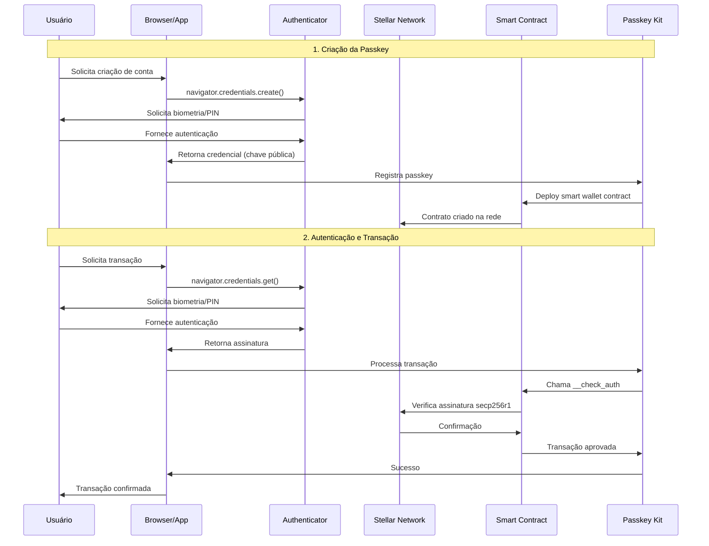
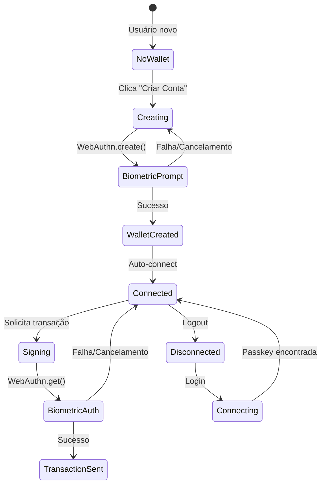

# Passkeys no Stellar: Guia Completo

## Diagrama de Sequência - Fluxo Geral de Passkeys



## Tópicos de Estudo

### Tópico 1: Conceitos Fundamentais - O que são Passkeys e WebAuthn

#### O que são Passkeys?
- **Definição**: Passkeys são uma implementação do padrão WebAuthn que elimina a necessidade de senhas tradicionais
- **Problema que resolve**: Remove a barreira de entrada das seed phrases (12-24 palavras) e chaves privadas complexas
- **Benefícios**:
  - Mais seguro que senhas tradicionais
  - Não pode ser phishing (vinculado ao domínio)
  - Experiência do usuário superior
  - Sincronização entre dispositivos

#### WebAuthn (Web Authentication)
- **Padrão W3C**: Especificação para autenticação sem senha na web
- **Criptografia de chave pública**: Cada passkey gera um par de chaves (pública/privada)
- **Authenticators**: Dispositivos que armazenam as chaves (celular, laptop, hardware tokens)
- **Tipos de verificação**:
  - Biométrica (impressão digital, Face ID)
  - PIN/Padrão
  - Hardware tokens (YubiKey)

#### Como funciona a criptografia?
- **Secp256r1**: Curva elíptica suportada nativamente pelo WebAuthn
- **Chave privada**: Nunca sai do dispositivo do usuário
- **Chave pública**: Compartilhada com o smart contract
- **Assinatura digital**: Prova que o usuário possui a chave privada sem revelá-la

#### Diferenças das carteiras tradicionais
| Carteira Tradicional | Smart Wallet com Passkey |
|---------------------|---------------------------|
| Seed phrase de 12-24 palavras | Biometria/PIN |
| Chave privada única | Par de chaves por dispositivo |
| Perda = perda total | Recuperação via outros dispositivos |
| Complexo para iniciantes | Familiar (como apps bancários) |

### Tópico 2: Arquitetura Técnica - Secp256r1, Criptografia e Smart Contracts

#### Secp256r1 no Stellar (Protocol 21)
- **Novidade**: Suporte nativo à curva secp256r1 desde o Protocol 21
- **Importância**: Mesma curva usada pelo WebAuthn/Passkeys
- **Diferença da secp256k1**: 
  - secp256k1: Usada pelo Bitcoin e Ethereum
  - secp256r1: Padrão NIST, suportada nativamente por hardware
- **Vantagem**: Verificação de assinatura diretamente no smart contract

#### Arquitetura do Smart Contract
```rust
// Estrutura básica do contrato
#[contract]
pub struct SmartWallet;

// Interface de autenticação customizada
impl CustomAccountInterface for SmartWallet {
    fn __check_auth(
        env: Env,
        signature_payload: Hash<32>,
        signature: Signature,
        auth_contexts: Vec<Context>,
    ) -> Result<(), ContractError> {
        // Verifica assinatura secp256r1
        // Valida contexto da transação
        // Autoriza ou rejeita
    }
}
```

#### Componentes da Arquitetura
1. **Factory Contract**: Cria novas smart wallets
2. **Wallet Contract**: Gerencia autenticação e transações
3. **Passkey Kit SDK**: Interface TypeScript para interação
4. **Launchtube**: Serviço para submissão de transações
5. **Mercury**: Indexação de eventos para consultas

#### Fluxo de Verificação Criptográfica
```
1. Usuário assina com passkey (secp256r1)
2. Browser gera assinatura + dados de autenticação
3. Smart contract recebe:
   - Signature (r, s)
   - Public key
   - Challenge original
4. Contrato verifica:
   - Assinatura é válida para a chave pública
   - Chave pública está registrada
   - Challenge corresponde à transação
5. Autoriza ou rejeita a operação
```

#### Segurança e Validações
- **Replay Protection**: Cada transação tem nonce único
- **Domain Binding**: Passkey vinculada ao domínio específico
- **Time-based Validation**: Transações podem ter expiração
- **Multi-signature**: Suporte a múltiplas passkeys por wallet
- **Recovery Mechanisms**: Passkeys de recuperação ou guardiões

### Tópico 3: Implementação Prática - Passkey Kit e Integração com Stellar

#### Instalação e Setup
```bash
# Instalar o Passkey Kit
pnpm i passkey-kit

# Dependências adicionais
pnpm i @stellar/stellar-sdk
```

#### Configuração do Cliente
```typescript
import { PasskeyKit } from 'passkey-kit';

const account = new PasskeyKit({
    rpcUrl: 'https://soroban-testnet.stellar.org',
    networkPassphrase: 'Test SDF Network ; September 2015',
    factoryContractId: 'FACTORY_CONTRACT_ID'
});
```

#### Configuração do Servidor
```typescript
import { PasskeyServer } from 'passkey-kit';

const server = new PasskeyServer({
    rpcUrl: process.env.RPC_URL,
    launchtubeUrl: process.env.LAUNCHTUBE_URL,
    launchtubeJwt: process.env.LAUNCHTUBE_JWT,
    mercuryUrl: process.env.MERCURY_URL,
    mercuryJwt: process.env.MERCURY_JWT
});
```

#### Serviços de Apoio

##### Launchtube
- **Função**: Submissão de transações sem se preocupar com fees ou sequence numbers
- **Benefício**: Simplifica o processo de envio de transações
- **Setup**: Requer JWT token para autenticação

##### Mercury
- **Função**: Indexação de eventos do smart contract
- **Uso**: Consulta rápida de passkeys registradas
- **Benefício**: Permite lookup reverso (chave pública → endereço da wallet)

#### Métodos Principais do SDK

```typescript
// Criar nova passkey e wallet
const result = await account.createWallet({
    name: 'Minha Wallet',
    domain: 'meuapp.com'
});

// Conectar com passkey existente
const wallet = await account.connectWallet({
    publicKey: 'PUBLIC_KEY_HEX'
});

// Enviar transação
const txResult = await account.send({
    to: 'DESTINATION_ADDRESS',
    amount: '100',
    asset: 'native'
});

// Adicionar nova passkey à wallet existente
const addResult = await account.addPasskey({
    name: 'Backup Key'
});
```

#### Estrutura de Projeto Recomendada
```
project/
├── src/
│   ├── client/          # Frontend com PasskeyKit
│   ├── server/          # Backend com PasskeyServer
│   └── contracts/       # Smart contracts Soroban
├── .env                 # Variáveis de ambiente
└── package.json
```

#### Variáveis de Ambiente Necessárias
```env
# Rede Stellar
PUBLIC_RPC_URL=https://soroban-testnet.stellar.org
PUBLIC_NETWORK_PASSPHRASE=Test SDF Network ; September 2015
PUBLIC_FACTORY_CONTRACT_ID=CONTRACT_ID

# Launchtube
PUBLIC_LAUNCHTUBE_URL=https://launchtube.stellar.org
PRIVATE_LAUNCHTUBE_JWT=your_jwt_token

# Mercury
PUBLIC_MERCURY_URL=https://api.mercurydata.app
PRIVATE_MERCURY_JWT=your_mercury_jwt
```

### Tópico 4: Fluxo de Autenticação - Criação e Uso de Passkeys

#### Fluxo Detalhado de Criação de Passkey

##### 1. Iniciação pelo Usuário
```typescript
// Usuário clica em "Criar Conta"
const createAccount = async () => {
    try {
        const result = await account.createWallet({
            name: 'Minha Smart Wallet',
            domain: window.location.hostname
        });
        console.log('Wallet criada:', result.contractId);
    } catch (error) {
        console.error('Erro na criação:', error);
    }
};
```

##### 2. Chamada WebAuthn (navigator.credentials.create)
```javascript
// Internamente, o PasskeyKit faz:
const credential = await navigator.credentials.create({
    publicKey: {
        challenge: new Uint8Array(32), // Challenge aleatório
        rp: {
            name: "Meu App",
            id: "meuapp.com"
        },
        user: {
            id: new TextEncoder().encode(userId),
            name: "usuario@email.com",
            displayName: "Nome do Usuário"
        },
        pubKeyCredParams: [{
            type: "public-key",
            alg: -7 // ES256 (secp256r1)
        }],
        authenticatorSelection: {
            authenticatorAttachment: "platform", // Biometria do dispositivo
            userVerification: "required"
        }
    }
});
```

##### 3. Processamento da Resposta
```typescript
// Extrair dados da credencial
const publicKey = extractPublicKey(credential.response.publicKey);
const credentialId = credential.rawId;

// Registrar no smart contract
const contractId = await deploySmartWallet({
    publicKey,
    credentialId,
    userInfo
});
```

#### Fluxo Detalhado de Autenticação

##### 1. Solicitação de Transação
```typescript
const sendPayment = async (to: string, amount: string) => {
    // 1. Preparar transação
    const transaction = await account.prepareTransaction({
        to,
        amount,
        asset: 'native'
    });
    
    // 2. Solicitar assinatura via passkey
    const signedTx = await account.sign(transaction);
    
    // 3. Submeter via Launchtube
    const result = await account.submit(signedTx);
    
    return result;
};
```

##### 2. Processo de Assinatura WebAuthn
```javascript
// Chamada interna para obter assinatura
const assertion = await navigator.credentials.get({
    publicKey: {
        challenge: transactionHash, // Hash da transação
        rpId: "meuapp.com",
        allowCredentials: [{
            type: "public-key",
            id: credentialId
        }],
        userVerification: "required"
    }
});
```

##### 3. Verificação no Smart Contract
```rust
// Método __check_auth no smart contract
fn __check_auth(
    env: Env,
    signature_payload: Hash<32>,
    signature: Signature,
    auth_contexts: Vec<Context>,
) -> Result<(), ContractError> {
    // 1. Recuperar chave pública registrada
    let stored_pubkey = get_registered_pubkey(&env)?;
    
    // 2. Verificar assinatura secp256r1
    env.crypto().secp256r1_verify(
        &stored_pubkey,
        &signature_payload.to_array(),
        &signature
    )?;
    
    // 3. Validar contextos de autorização
    validate_auth_contexts(&env, &auth_contexts)?;
    
    Ok(())
}
```

#### Estados e Transições



#### Tratamento de Erros Comuns

```typescript
// Erros típicos e como lidar
const handlePasskeyErrors = (error: any) => {
    switch (error.name) {
        case 'NotSupportedError':
            return 'Passkeys não suportadas neste navegador';
        case 'NotAllowedError':
            return 'Usuário cancelou ou falhou na autenticação';
        case 'InvalidStateError':
            return 'Passkey já existe para este usuário';
        case 'ConstraintError':
            return 'Parâmetros inválidos';
        default:
            return 'Erro desconhecido na passkey';
    }
};
```

#### Sincronização Entre Dispositivos
- **iCloud Keychain**: Sincronização automática entre dispositivos Apple
- **Google Password Manager**: Sincronização entre dispositivos Android/Chrome
- **Backup Manual**: Exportar/importar chaves para outros dispositivos
- **Recovery Keys**: Passkeys de recuperação para casos de perda de dispositivo

### Tópico 5: Casos de Uso e Exemplos Práticos - Smart Wallets e Aplicações

#### Exemplos de Aplicações Reais

##### 1. Super Peach (Exemplo Completo)
- **Repositório**: [github.com/kalepail/superpeach](https://github.com/kalepail/superpeach)
- **Funcionalidades**:
  - Criação de wallet com passkey
  - Envio de pagamentos
  - Histórico de transações
  - Interface moderna e intuitiva
- **Tecnologias**: Next.js, PasskeyKit, Tailwind CSS

##### 2. Demo Passkey Kit
- **URL**: [passkey-kit-demo.pages.dev](https://passkey-kit-demo.pages.dev/)
- **Demonstra**:
  - Fluxo completo de criação de passkey
  - Autenticação biométrica
  - Transações na testnet
  - Gerenciamento de múltiplas passkeys

#### Casos de Uso Práticos

##### 1. DeFi Simplificado
```typescript
// Exemplo: Swap de tokens sem seed phrases
const defiApp = {
    async swapTokens(fromAsset: string, toAsset: string, amount: string) {
        // Usuário só precisa usar biometria
        const result = await account.contractCall({
            contractId: 'SWAP_CONTRACT_ID',
            method: 'swap',
            args: [fromAsset, toAsset, amount]
        });
        return result;
    }
};
```

##### 2. Gaming e NFTs
```typescript
// Exemplo: Compra de NFT com passkey
const gameApp = {
    async buyNFT(nftId: string, price: string) {
        const result = await account.send({
            to: 'NFT_MARKETPLACE_CONTRACT',
            amount: price,
            memo: `buy_nft:${nftId}`
        });
        return result;
    }
};
```

##### 3. Pagamentos Corporativos
```typescript
// Exemplo: Sistema de aprovação multi-assinatura
const corporateWallet = {
    async createMultiSigPayment(to: string, amount: string, approvers: string[]) {
        // Requer aprovação de múltiplas passkeys
        const proposal = await account.createProposal({
            type: 'payment',
            to,
            amount,
            requiredApprovals: approvers.length
        });
        return proposal;
    }
};
```

#### Vantagens Competitivas

##### Para Desenvolvedores
- **Onboarding Simplificado**: Usuários não precisam aprender sobre seed phrases
- **Menor Suporte**: Menos tickets sobre "perdi minha carteira"
- **Maior Adoção**: Interface familiar (como apps bancários)
- **Segurança Superior**: Impossível phishing de passkeys

##### Para Usuários
- **Experiência Familiar**: Igual ao Face ID/Touch ID
- **Sem Backup Manual**: Sincronização automática na nuvem
- **Recuperação Simples**: Adicionar novo dispositivo é fácil
- **Múltiplos Dispositivos**: Mesma wallet em vários dispositivos

#### Limitações e Considerações

##### Limitações Técnicas
- **Suporte de Navegador**: Nem todos os navegadores suportam WebAuthn
- **Dispositivos Antigos**: Hardware sem biometria não funciona
- **Dependência de Nuvem**: Sincronização depende de iCloud/Google

##### Soluções e Workarounds
```typescript
// Detecção de suporte a passkeys
const checkPasskeySupport = () => {
    if (!window.PublicKeyCredential) {
        return { supported: false, reason: 'WebAuthn não suportado' };
    }
    
    return { supported: true };
};

// Fallback para dispositivos sem suporte
const createWalletWithFallback = async () => {
    const support = checkPasskeySupport();
    
    if (!support.supported) {
        // Fallback para carteira tradicional
        return createTraditionalWallet();
    }
    
    return account.createWallet();
};
```

#### Roadmap e Futuro

##### Melhorias Planejadas
- **Cross-platform**: Passkeys funcionando entre iOS/Android/Desktop
- **Hardware Wallets**: Integração com Ledger/Trezor via WebAuthn
- **Enterprise Features**: Políticas de segurança corporativas
- **Social Recovery**: Recuperação via amigos/família

##### Adoção no Ecossistema
- **Stellar**: Suporte nativo desde Protocol 21
- **Outras Blockchains**: Ethereum, Solana explorando implementações
- **Padrões**: Propostas de padronização cross-chain

#### Recursos para Desenvolvimento

##### Documentação e Tutoriais
- [Stellar Smart Wallets Docs](https://developers.stellar.org/docs/build/apps/smart-wallets)
- [PasskeyKit GitHub](https://github.com/kalepail/passkey-kit)
- [WebAuthn Guide](https://webauthn.guide/)

##### Comunidade e Suporte
- **Discord**: Canal `#passkeys` no [Stellar Dev Discord](https://discord.gg/stellardev)
- **GitHub Issues**: Reportar bugs e solicitar features
- **Stellar Community Fund**: Financiamento para projetos inovadores

##### Ferramentas de Desenvolvimento
```bash
# Starter template
git clone https://github.com/kalepail/passkey-starter
cd passkey-starter
pnpm install
pnpm dev
```

#### Conclusão

As passkeys representam uma revolução na experiência do usuário blockchain, removendo a principal barreira de entrada (seed phrases complexas) enquanto aumentam a segurança. Com o suporte nativo do Stellar via Protocol 21 e ferramentas como o PasskeyKit, desenvolvedores podem criar aplicações Web3 com UX comparável a aplicações Web2 tradicionais.

O futuro das carteiras digitais está nas smart wallets com passkeys, oferecendo:
- **Segurança superior** através de criptografia de hardware
- **Experiência familiar** para usuários mainstream
- **Recuperação simplificada** sem seed phrases
- **Adoção em massa** através de UX superior

Para desenvolvedores interessados em implementar passkeys, recomenda-se começar com o demo do PasskeyKit e explorar os exemplos práticos disponíveis na comunidade Stellar.